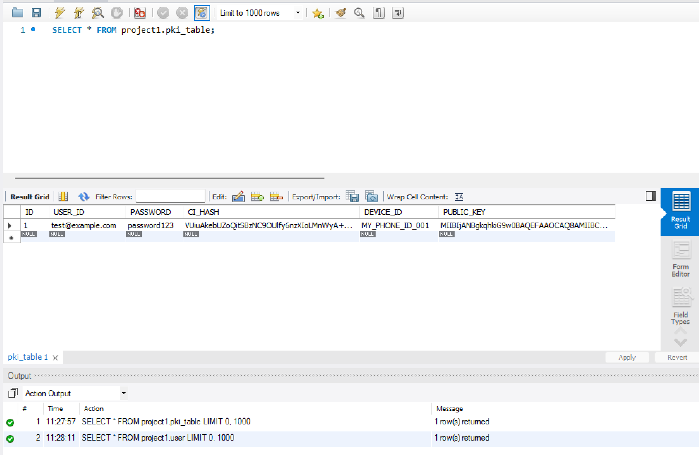
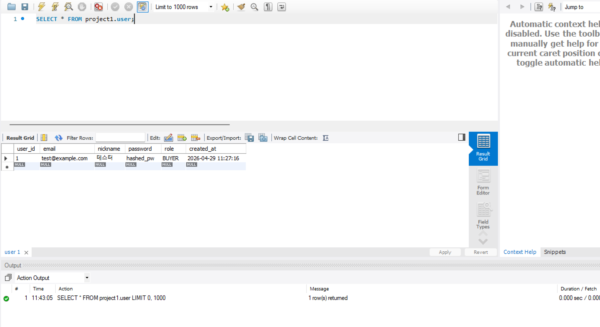

# 🚀 팀 프로젝트 DB & PKI 연동 가이드

이 가이드는 `USER` 테이블과 `pki_table`을 성공적으로 매칭하고, 스프링 백엔드를 MySQL에 연동하는 과정을 정리한 것입니다. 팀원들은 아래 순서대로 설정을 진행해 주세요.

---

## 1. MySQL 데이터베이스 설정 (Workbench)

먼저, MySQL에 접속하여 프로젝트용 데이터베이스와 테이블을 생성해야 합니다.

### (1) 데이터베이스 생성
```sql
CREATE DATABASE IF NOT EXISTS project1;
USE project1;
```

### (2) 테이블 생성 (핵심 매칭 구조)
`USER` 테이블의 **email**과 `pki_table`의 **USER_ID**를 연결 고리로 사용합니다.

```sql
-- 회원 기본 정보 테이블
CREATE TABLE USER (
    user_id BIGINT AUTO_INCREMENT PRIMARY KEY,
    email VARCHAR(255) UNIQUE NOT NULL,        -- PKI 테이블과 연결되는 기준
    nickname VARCHAR(100),
    password VARCHAR(255) NOT NULL,             -- bcrypt 암호화 권장
    role VARCHAR(20) NOT NULL,                  -- ADMIN / SELLER / BUYER
    created_at DATETIME DEFAULT CURRENT_TIMESTAMP
);

-- PKI 보안 인증 테이블
CREATE TABLE pki_table (
    ID BIGINT AUTO_INCREMENT PRIMARY KEY,
    USER_ID VARCHAR(255) UNIQUE,                -- USER 테이블의 email을 저장 (외래키)
    PASSWORD VARCHAR(255),
    CI_HASH VARCHAR(255),
    DEVICE_ID VARCHAR(100),
    PUBLIC_KEY VARCHAR(2000),
    CONSTRAINT fk_pki_user_email FOREIGN KEY (USER_ID) REFERENCES USER(email)
);
```

---

## 2. 스프링 부트 (Spring Boot) 설정 변경

### (1) build.gradle 수정
MySQL 드라이버를 추가해야 합니다.
```gradle
dependencies {
    // ... 기존 의존성
    runtimeOnly 'com.mysql:mysql-connector-j'
}
```

### (2) application.properties 수정
기존 H2 설정을 주석 처리하고 아래 내용을 추가하세요.
```properties
# MySQL 접속 정보
spring.datasource.url=jdbc:mysql://localhost:3306/project1?serverTimezone=UTC&characterEncoding=UTF-8
spring.datasource.username=root
spring.datasource.password=123456
spring.datasource.driver-class-name=com.mysql.cj.jdbc.Driver

# JPA 설정 (테이블 구조 보호를 위해 none 권장)
spring.jpa.hibernate.ddl-auto=none
spring.jpa.show-sql=true
```

### (3) User.java 엔티티 수정
`pki` 패키지의 엔티티가 우리가 만든 테이블을 바라보도록 수정합니다.
```java
@Entity
@Table(name = "pki_table") // 'users'에서 'pki_table'로 변경
public class User { ... }
```

---

## 3. 연동 테스트 방법 (PowerShell 이용)

앱을 실행한 후, 터미널에서 아래 명령어를 순서대로 입력하여 데이터가 잘 들어가는지 확인하세요.

### (1) 테스트용 부모 데이터(USER) 삽입
```powershell
# MySQL에 직접 입력하거나 API로 생성
INSERT INTO project1.USER (email, nickname, password, role) 
VALUES ('test@example.com', '테스터', 'hashed_pw', 'BUYER');
```

### (2) PKI 회원가입 API 호출
```powershell
Invoke-RestMethod -Uri "http://localhost:8080/api/pki/signup" -Method Post -ContentType "application/json" -Body '{"userId": "test@example.com", "ci": "MY_SECRET_CI_123", "password": "password123", "publicKey": "RSA_KEY_STRING...", "deviceId": "MY_PHONE_001"}'
```

---

## 💡 주의사항 (Golden Rules)
1. **이메일 매칭:** `pki_table`에 데이터를 넣기 전, 반드시 `USER` 테이블에 해당 이메일이 먼저 존재해야 합니다 (외래키 제약).
2. **비밀번호 보안:** 현재 테스트용으로는 평문을 사용하지만, 실제 개발 시에는 반드시 암호화하여 저장하세요.
3. **병합 공유:** DB 구조를 변경했으므로 팀원들에게 즉시 공유해 주세요!

---

## ! 결과 내용 확인 (DB 캡처) 

- pki_table 테이블 db 내용 캡처 


---
- user 테이블 db 내용 캡처


---

 * MySQL Workbench에서: INSERT 문 실행 (기본 사용자 생성)
 * PowerShell에서: Invoke-RestMethod 실행 (PKI 보안 정보 생성) 
 - Invoke-RestMethod :"API가 잘 작동하는지 확인하기 위해 파워쉘에서 사용하는
  테스트용 명령어"