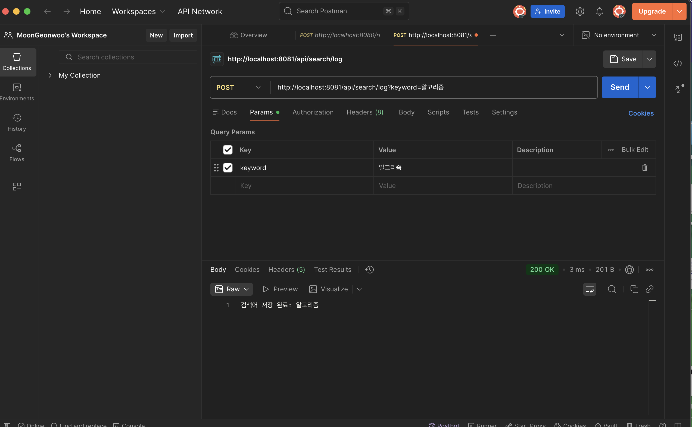
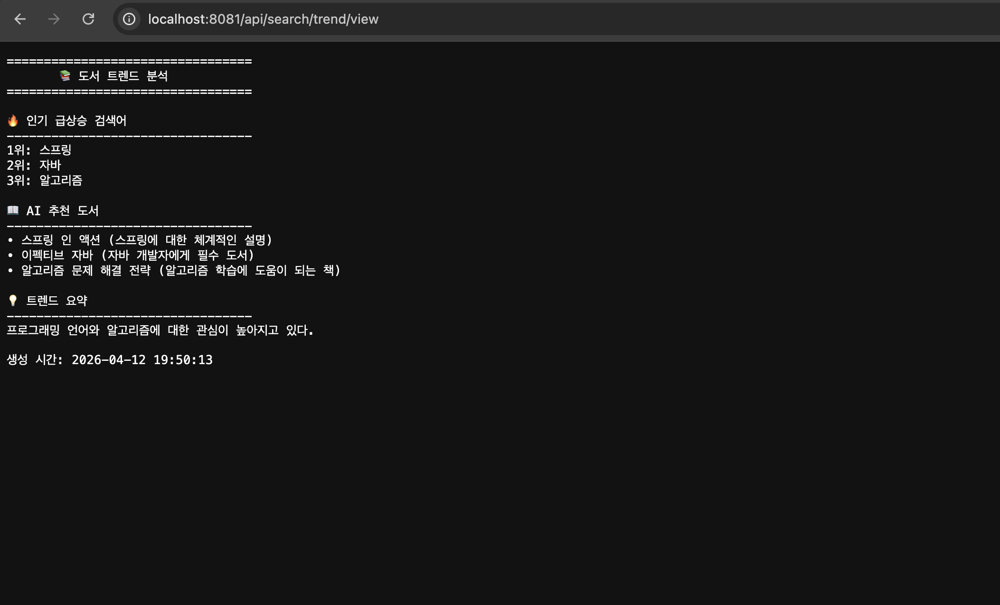

# 📚 AI 도서 검색 트렌드 분석


---

## 🛠 기술 스택
- Spring Boot
- Java 17
- WebFlux (OpenAI API 호출)
- OpenAI GPT-3.5-turbo
- Spring Data JPA
- MySQL

---

## ✅ 구현 기능

### 1. 검색어 저장
- 사용자가 도서 검색할 때마다 검색어와 횟수 저장
- MySQL DB에 영구 저장 (search_log 테이블)
- 동일 검색어 재검색 시 횟수 누적

### 2. 인기 검색어 조회
- 검색 횟수 기준 상위 10개 정렬
- 많이 검색된 순서대로 반환

### 3. AI 트렌드 분석 (핵심 기능)
- 검색 데이터를 OpenAI GPT-3.5-turbo에 전달
- 인기 급상승 키워드 top3 분석
- 검색 트렌드 기반 도서 3권 추천
- 트렌드 요약 한 줄 제공

### 4. 가독성 있는 텍스트 출력
- JSON이 아닌 텍스트 형식으로 보기 좋게 출력
- 이모지와 구분선으로 가독성 향상

---

## 📋 API 목록

| Method | URL | 설명 |
|--------|-----|------|
| POST | /api/search/log | 검색어 저장 |
| GET | /api/search/top | 상위 10개 검색어 조회 |
| GET | /api/search/trend | AI 트렌드 분석 (JSON) |
| GET | /api/search/trend/view | AI 트렌드 분석 (텍스트) |
| GET | /api/search/all | 전체 검색 현황 |

---

## ⚙️ 실행 방법

### 1. MySQL DB 생성
```sql
CREATE DATABASE searchdb CHARACTER SET utf8mb4 COLLATE utf8mb4_unicode_ci;
```

### 2. application.yml 생성

src/main/resources/application.yml 파일 생성 후 아래 내용 붙여넣기

```yaml
spring:
  application:
    name: ai-search-trend
  datasource:
    url: jdbc:mysql://localhost:3306/searchdb?useSSL=false&serverTimezone=Asia/Seoul&allowPublicKeyRetrieval=true
    driver-class-name: com.mysql.cj.jdbc.Driver
    username: root
    password: 본인_MySQL_비밀번호
  jpa:
    hibernate:
      ddl-auto: update
    show-sql: true

server:
  port: 8081

openai:
  api-key: 본인_OpenAI_API_키_입력
  model: gpt-3.5-turbo
```

### 3. OpenAI API 키 발급
```
https://platform.openai.com 접속
→ 로그인
→ API Keys
→ Create new secret key
→ 복사해서 application.yml에 입력
```

### 4. 서버 실행
```
AiSearchTrendApplication.java 실행
```
서버 시작 시 search_log 테이블 자동 생성됩니다.

---

## 🧪 테스트 방법

### 1. 검색어 저장 (Postman)
```
POST http://localhost:8081/api/search/log?keyword=자바
POST http://localhost:8081/api/search/log?keyword=자바
POST http://localhost:8081/api/search/log?keyword=스프링
POST http://localhost:8081/api/search/log?keyword=파이썬
POST http://localhost:8081/api/search/log?keyword=알고리즘
```


### 2. 인기 검색어 확인
```
GET http://localhost:8081/api/search/top
```

### 3. AI 트렌드 분석 (텍스트)
```
GET http://localhost:8081/api/search/trend/view
```

### 4. 예상 결과



---

## ⚠️ 주의사항
- application.yml은 보안상 깃허브에 올리지 않습니다
- OpenAI API 키는 유료이므로 본인 키를 직접 발급받아야 합니다
- MySQL이 로컬에 설치되어 있어야 합니다

---

## 💡 기존 방식과 차이점

| | 단순 DB 집계 | AI 활용 |
|---|---|---|
| 인기 검색어 순위 | ✅ 가능 | ✅ 가능 |
| 트렌드 분석 | ❌ 불가 | ✅ 가능 |
| 도서 추천 | ❌ 불가 | ✅ 가능 |
| 트렌드 이유 설명 | ❌ 불가 | ✅ 가능 |


## ✅ DB 연동 완료

| 테이블 | 컬럼 | 설명 |
|--------|------|------|
| search_log | id | 자동 증가 PK |
| | keyword | 검색어 (unique) |
| | search_count | 검색 횟수 |
| | last_searched | 마지막 검색 시간 |

---

##  추후 개발 예정

- [x] DB 연동 (JPA + MySQL)
      → MySQL search_log 테이블에 영구 저장

- [ ] 검색어 기반 개인화 추천
      → 사용자별 검색 기록 저장
      → 개인 맞춤 도서 추천 기능

- [ ] 실시간 검색어 순위 갱신
      → 현재 요청할 때만 순위 갱신
      → 일정 주기로 자동 갱신 예정

- [ ] 검색어 통계 시각화
      → Chart.js 활용하여 검색 트렌드 그래프로 표시

- [ ] AWS 배포
      → 현재 로컬 환경에서만 동작
      → EC2 배포 예정


